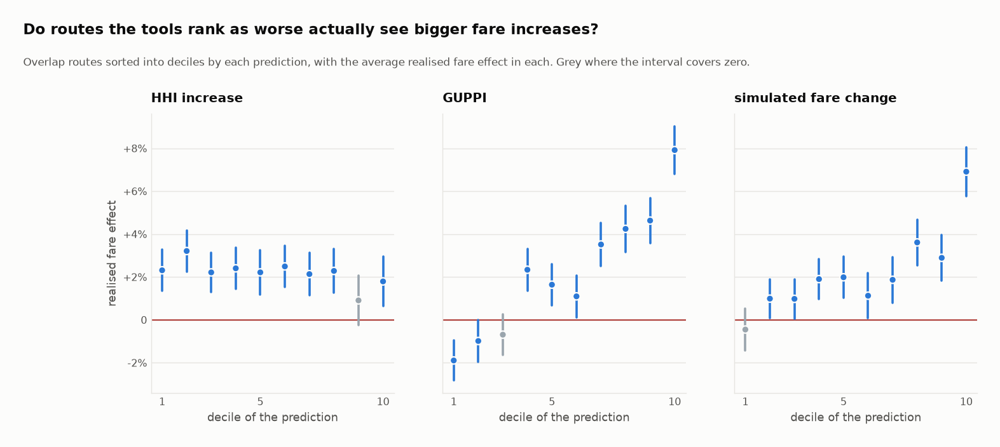
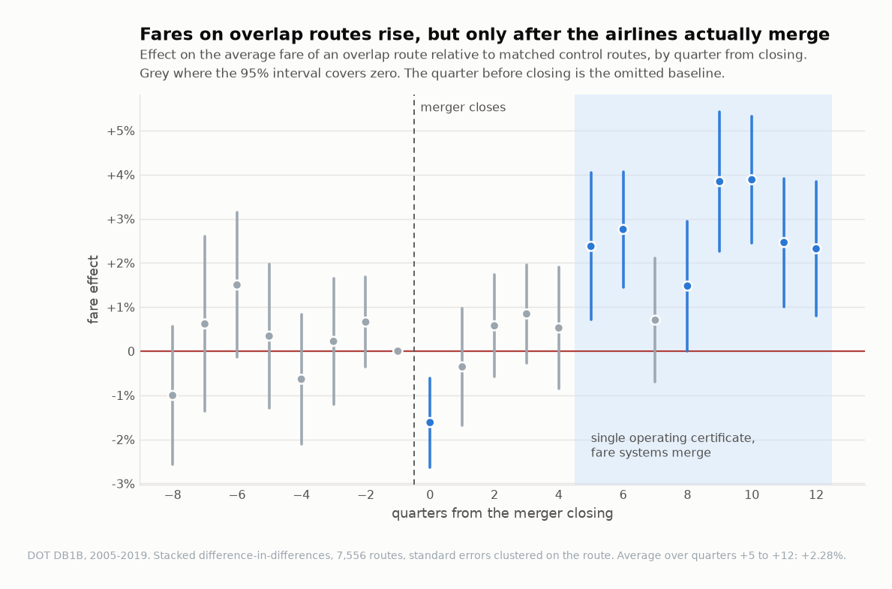
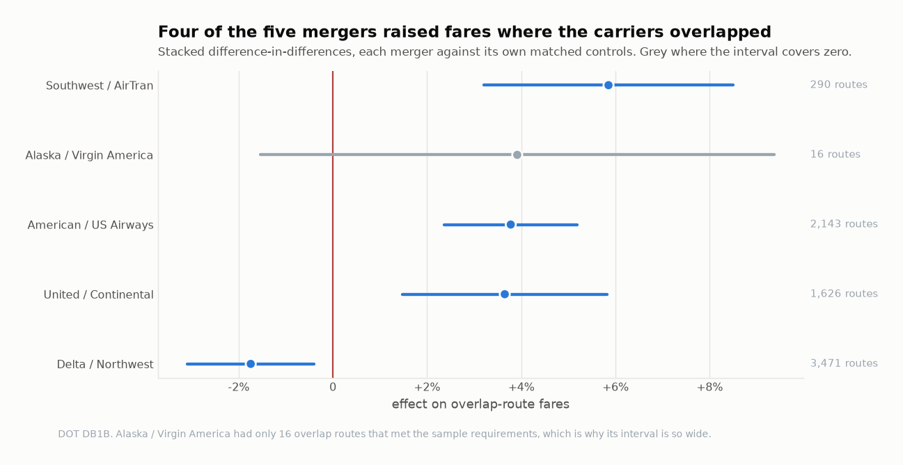
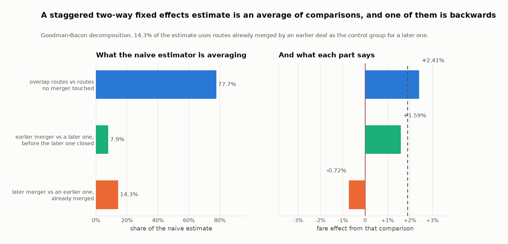
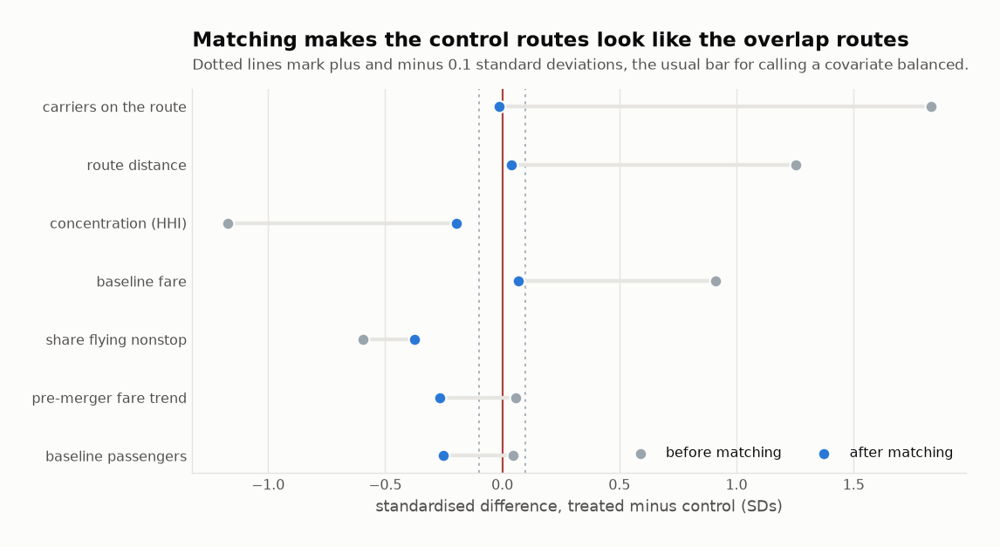
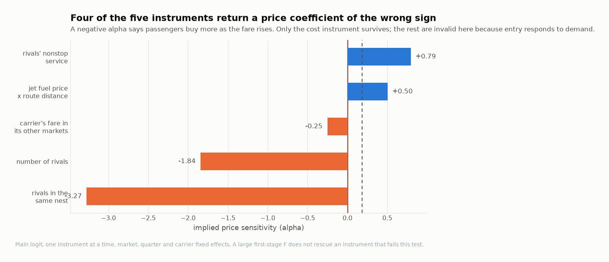

# Do merger screens predict which routes get more expensive?

When two airlines merge, antitrust agencies decide which routes to worry about
before anything happens. The cheapest tool they have is concentration: measure
how much the merger raises the Herfindahl index on a route, and flag the ones
where it rises most. Five US airline mergers and fifteen years of ticket data
say that tool does not work — and that a more expensive one, sitting right next
to it, works well.

**[Open the interactive dashboard](https://josealemanm.github.io/us-airline-merger-price-effects/dashboard.html)**
No installation. It runs in the browser.



Sort the overlap routes by how much a merger raised concentration, and the fares
that followed are flat across the whole range. Sort the same routes by the value
of sales diverted to the merger partner, and they climb from −1.9% to +7.9%.
Both numbers were computable before the deals closed.

## Why the question matters

A merger review has to happen in advance. The agency has the current market and
some months, and it has to decide which parts of a deal will hurt consumers.

For an airline merger, "which parts" means which routes. American and US Airways
sold tickets on thousands of city pairs between them, and on most of those only
one of the two was selling. Those routes lose nothing: the merged carrier faces
the same competitors it faced the day before. The routes at issue are the ones
where **both** carriers were selling, because on those the merger removes a
competitor. There were 8,009 of them across the five deals studied here.

Not all 8,009 are equally worrying, and the agency has to rank them. The 2023
Merger Guidelines give a structural answer. Compute the Herfindahl-Hirschman
index — the sum of squared market shares — before and after. If the merger
leaves the route concentrated and raises the index by more than 100 points, the
merger is presumed to lessen competition there.

That screen is cheap. It needs nothing but passenger counts, no model of how
people choose flights, no assumption about how airlines set fares. On these
8,009 routes it flags 74% of them.

There is a second way to ask the question, and it is considerably more work.
Estimate how passengers substitute between carriers, work out what fraction of
the passengers priced off one merging carrier would switch to the other, and
multiply by what those passengers were worth. That is the **diversion ratio**,
and the statistic built from it is **GUPPI** — gross upward pricing pressure. A
route where a fare rise pushes passengers straight onto the merger partner is a
route where the merged firm has a real incentive to raise fares. A route where
they scatter to third carriers is not.

Both are predictions. Fifteen years of data say what happened next.

**The question, stated exactly:** across the five large US airline mergers
completed between 2008 and 2016, do routes that the structural screen flags
turn out to be the routes where fares actually rose, and do diversion-based
measures do any better?

## What the data says

**Fares on overlap routes rose, and the increase is real.** Relative to matched
control routes, fares on routes where both merging carriers had been selling
rose **1.31%** (95% interval [+0.42%, +2.19%]), and **2.28%** [+1.30%, +3.26%]
once the carriers were operating under a single certificate.

**The timing is the first surprise.** Nothing happens for four quarters.



Every coefficient from the closing quarter through quarter +4 is
indistinguishable from zero. The effect appears at quarter +5 and persists. That
is not a statistical artefact; it is when airlines actually merge. Two carriers
that have legally combined still fly under separate operating certificates, with
separate reservation systems and separate fare filings, for four to six quarters
afterwards. Until the certificates merge there is no single firm setting one
price. **A retrospective that stopped at one year would have found
nothing:** every coefficient from the closing quarter through quarter +4
lies between -1.6% and +0.8%.

**The structural screen does not sort the routes.** This is the finding.

| | routes | average realised fare effect |
|---|---|---|
| flagged by the structural presumption | 5,864 | +2.01% |
| not flagged | 2,072 | +2.72% |
| **difference** | | **−0.71%** [−1.41%, −0.01%] |

The flagged routes saw *smaller* fare increases than the unflagged ones. Not
dramatically so, and the interval only barely clears zero, but the screen is
certainly not picking out the routes where harm landed. Sorting by the HHI
increase into deciles gives a flat line: +2.31% in the bottom decile, +1.79% in
the top, and no trend in between.

Moving the threshold does not rescue it. At every cut-off tested, from 50 points
to 2,000, the flagged group has a *smaller* average fare increase than the
unflagged group. The problem is not where the line sits.

**Diversion-based measures do sort the routes.** The same 7,936 routes, the same
realised effects, a different way of ranking them:

| prediction | realised effect per SD of the prediction | rank correlation |
|---|---|---|
| GUPPI | **+2.77%** (0.22) | +0.189 |
| diversion to the merger partner | +2.26% (0.19) | +0.118 |
| simulated fare change | +2.20% (0.22) | +0.116 |
| increase in HHI | +0.24% (0.20) | −0.017 |
| combined share of the two parties | −0.59% (0.19) | −0.060 |

A one-standard-deviation increase in GUPPI is worth 2.77 percentage points of
realised fare increase. The same figure for the HHI increase is 0.24 points with
a standard error of 0.20 — indistinguishable from nothing (p = 0.25). Combined
share is worse than useless: it points the wrong way.

Every one of those predictions is computed from pre-merger data alone. The
information needed to rank these routes correctly was available at the time.

**The simulation is informative and badly scaled, and those are different
findings.** Regressing the realised effect on the simulated one gives a slope of
**0.57** [0.46, 0.68]. Against the null that the simulation carries no
information, that rejects decisively. Against the null that it is correctly
scaled — a slope of one — it also rejects. The simulation over-states the size
of the effect by roughly a factor of 1.8 while still ordering the routes
correctly, which is exactly what calibrating the price coefficient rather than
estimating it would be expected to do.

**The mergers differ from each other more than the average suggests.**



Four of five raised fares on their overlap routes. Delta/Northwest lowered
them, by 1.74% [−3.09%, −0.39%]. It is the earliest deal, the one with the most
overlap routes, and the one where the two networks were most complementary;
whether that is the explanation, this data cannot say. Alaska/Virgin America had
only 16 overlap routes clearing the sample requirements, and its interval is
correspondingly useless.

## What went wrong along the way

Three things broke, and what they broke is more interesting than the fixes.

**The naive estimator gives the wrong sign.** Pooling all five mergers into one
regression with route and quarter fixed effects returns **−2.41%**: mergers
lowered fares. Two separate problems produce that. The first is the control
group, below. The second is staggering, and it has a name.



Goodman-Bacon (2021) proved that a two-way fixed effects coefficient on
staggered treatment is a weighted average of every two-by-two comparison
available in the data — and that when treatment timing varies, some of those
comparisons use *already-treated* units as the control group for later-treated
ones. Here, **14.3%** of the weight sits on comparisons that use routes already
affected by an earlier merger as the counterfactual for a later one. Since the
effect of a merger grows over the first two years, those comparisons subtract
one merger's ongoing fare increase from another merger's estimate, with a
negative sign. `src/econ/bacon.py` implements the decomposition and checks
itself: the weighted components must reproduce the regression coefficient
exactly, or it raises rather than returning a number.

**The obvious control group was the wrong one.** The first version compared
overlap routes against routes where *neither* merging carrier flew. That reads
as the cleanest possible comparison and it is not. A route where both American
and US Airways sold tickets is long, busy and concentrated by construction; a
route where neither sold anything is short, thin and often served by a single
low-cost carrier. The two groups were never going to trend together.

The control group used instead is routes where **exactly one** of the two
carriers was selling. Both groups absorb whatever the merger did to the combined
airline's costs, network and frequent-flyer programme. Only overlap routes lose
a competitor. The difference between them is the competitive effect with the
system-wide effects differenced out.

That choice and the matching are the two decisions that move the answer most,
and what they do is easier to see together than one at a time:

| control group | without matching | with matching |
|---|---|---|
| routes where neither party flew | −2.63% [−4.11, −1.14] | +1.11% [−1.33, +3.55] |
| routes where exactly one party flew | −0.11% [−1.26, +1.05] | **+1.31% [+0.42, +2.19]** |

The top-left cell is the version that would have been reported by somebody who
took the obvious comparison and did not check it: a statistically significant
*fall* in fares. Matching alone is enough to bring the two control groups into
agreement on sign, which is reassuring — but not enough to make them equally
informative. Matching onto routes neither carrier served leaves few comparable
controls and an interval more than twice as wide. The reported specification is
the bottom-right cell.

**Inverse-odds weighting collapsed the control group.** Matching controls to
treated routes is textbook: estimate the probability a route is an overlap
route, then weight controls by the odds. Doing exactly that produced confidence
intervals of ±8 percentage points on tens of thousands of observations, which is
absurd. The cause was visible on inspection: a handful of control routes sat at
propensities near one, their odds ran into the tens, and after multiplying by
passenger traffic the control arm for one merger had an effective sample size of
**3.4 routes**. Ten routes carried 97% of the weight.

Nearest-neighbour matching bounds that, because a control route can only ever be
weighted by the treated routes it actually stands in for. Effective control
counts went from single digits to the hundreds and the intervals fell to ±1
point. `src/econ/matching.py` carries the diagnostic, and the balance table is
reported rather than asserted.



## Where the analysis stops being able to support itself

The demand estimation failed, and the honest thing is to put that at the same
level as the findings rather than in a footnote.

GUPPI needs a demand system. Estimating one means instrumenting the fare, since
airlines charge more where demand is strong. Five instruments were built. Rather
than throw them in together and read the overidentification test, each was run
on its own:



Three of the five return a price coefficient of the **wrong sign** — passengers
buying more as the fare rises. They fail together and for one reason: entry
responds to demand. A carrier adds a route when it expects the route to sell, so
a positive demand shock brings in rivals, rivals push the fare down, and an
instrument built on rival counts carries the very shock it was supposed to
exclude. Their first-stage F statistics are in the hundreds and thousands. A
strong instrument can be a completely invalid one, and the usual battery of
diagnostics would not have caught this.

Of the two that come back with the right sign, only one has an exclusion
restriction worth defending: jet fuel prices interacted with route distance, a
cost shifter with no demand story attached. It is much the weakest in the first
stage — F = 23, against 707 for the next weakest — and it gives a price
coefficient of the right sign, larger than OLS, exactly as the endogeneity
argument predicts. The other survivor is rivals' nonstop service, which passes
this particular test but is still a market-structure instrument with the same
entry problem, so it is not used either. It also implies a median own-price
elasticity of **−1.25**, and a profit-maximising firm never prices where its own
demand is inelastic. As a demand system it is inadmissible: the Bertrand
first-order condition would return a negative marginal cost.

So the simulation does not run on an estimate. The price coefficient is
**calibrated** to a median own-price elasticity of −2.5, within the range of
published estimates for US airline demand, and the whole exercise is re-run at
−1.5 and −4.0. This is labelled as a calibration everywhere it appears, and it
is what an agency does when the demand estimation on the record will not support
a simulation.

One consequence makes the headline finding survive it. Under logit demand,
diversion ratios depend on market shares and not on the price coefficient at
all. So the *level* of every GUPPI scales with the calibration while the
*ordering* of routes barely moves: the rank correlation between the reported run
and every alternative never falls below **0.92**. The finding above is about
ordering. The dollar figures in `reports/simulation.md` are not, and should be
read as scaled to an assumption.

## How much to believe it

**The placebo passes.** Routes where only one merging carrier flew, compared
against routes where neither did, give **−0.04%** [−0.98%, +0.90%]. Neither
group loses a competitor, so a large effect there would mean the design was
picking up something other than the loss of competition. It finds nothing.

**Pre-trends are close to flat, and the joint test still rejects.** Every
coefficient before the merger is individually indistinguishable from zero and
the largest is 1.5%, but the joint test across all of them rejects at p < 0.001.
Both of those are true and the second is the one usually left out. With 6,400
clusters the test has the power to detect very small deviations, and it is
detecting one. The pre-period coefficients bounce rather than trend, which is
the pattern you want to see, but this design is not perfectly clean and the
headline estimate should be read with that attached.

**The result does not depend on the weighting.** Weighted by pre-merger traffic
rather than counting routes equally, the estimate is +1.75% instead of +1.31%.

**Inference does not depend on asymptotics.** A wild cluster bootstrap over 299
draws gives p = 0.003.

| test | what it asks | result |
|---|---|---|
| placebo on one-party routes | is the design picking up non-competitive effects? | −0.04% [−0.98%, +0.90%] |
| wild cluster bootstrap | does the interval need the cluster count to be large? | p = 0.003 |
| weighted by traffic | is this about the average route or the average passenger? | +1.75% |
| matching switched off | how much of the estimate is the matching doing? | −0.11% |
| quarters +5 to +12 only | what happens once the carriers really are one firm? | +2.28% [+1.30%, +3.26%] |

## Reading the numbers

**Overlap route.** A city pair where both merging carriers each held at least 1%
of passengers, averaged over the four quarters before the merger was *announced*
rather than before it closed. Carriers move capacity once a deal is public, so a
baseline measured after the announcement would be partly an outcome of the
merger.

**HHI and its increase.** The Herfindahl-Hirschman index is the sum of squared
market shares on a 0–10,000 scale: a monopoly is 10,000, four equal firms is
2,500. A merger of two firms raises it by exactly twice the product of their
shares. The 2023 Merger Guidelines presume a merger lessens competition where
the post-merger index exceeds 1,800 and the increase exceeds 100.

**Diversion ratio.** Of the passengers who stop buying carrier A's ticket when
its fare rises, the fraction who buy carrier B's. It is the number that decides
whether a merger between A and B matters, and it is not observable — it has to
come from an estimated demand system.

**GUPPI.** Gross upward pricing pressure. The value of the sales A diverts to B
when A raises its fare, as a fraction of A's fare. A GUPPI of 5% means the
merger gives A an incentive to price as though its marginal cost had risen 5%.

**Realised effect.** The change in a route's average real fare from the eight
quarters before closing to quarters +5 through +12, minus the same change on its
matched control routes.

**Stacked difference-in-differences.** Each merger gets its own block: its
overlap routes, its controls, its own twenty-one-quarter window. Route-by-block
and quarter-by-block fixed effects mean no comparison ever reaches across
mergers, so the contamination the Bacon decomposition measures cannot arise.

**95% interval.** Clustered on the route, because fares on a route are
correlated from quarter to quarter and treating sixty quarters of one route as
sixty independent draws would produce intervals far too narrow. In every chart,
an estimate whose interval covers zero is drawn in grey.

## The data

| | |
|---|---|
| Source | US DOT Bureau of Transportation Statistics, Airline Origin and Destination Survey (DB1B), Market file |
| Window | 60 quarters, 2005Q1 to 2019Q4 |
| Volume | 344 million ticket records, 5.2 GB downloaded |
| After filtering | 19,189 routes, 696,963 route-quarters, 2.3 million carrier-route-quarters |
| Overlap routes | 8,009 across five mergers |
| Deflator | CPI-U, from FRED; fares in constant 2019 dollars |
| Cost instrument | US Gulf Coast jet fuel spot price, from FRED |

DB1B is a 10% sample of every domestic ticket sold in the United States,
reported quarterly by the carriers. Each record carries the origin and
destination, the ticketing carrier, the fare and the number of passengers. It is
the dataset the agencies themselves use for airline competition analysis.

The window stops at 2019Q4 deliberately. The pandemic makes 2020 fares
uninterpretable as a control period, and the last merger studied needs twelve
quarters of follow-up.

Mergers studied: Delta/Northwest (closed 2008Q4), United/Continental (2010Q4),
Southwest/AirTran (2011Q2), American/US Airways (2013Q4), Alaska/Virgin America
(2016Q4).

The event dates are not taken on trust. `src/03_validate.py` checks them against
the data: each acquired carrier should stop appearing as a ticketing carrier
when its brand is retired, and each one does.

## How it's built

Twelve stages, each a script that can be run on its own.

1. **Pull** (`01_pull_db1b.py`) — 60 quarterly files from BTS with retry and
   backoff. Each unpacks to roughly six million ticket records, too much to keep
   sixty times over, so every quarter is aggregated to its analysis grain on
   arrival and the raw file deleted. The manifest records the URL, byte count
   and SHA-256 of every file.
2. **Macro** (`02_pull_macro.py`) — CPI-U and jet fuel from FRED.
3. **Validate** (`03_validate.py`) — completeness, duplicates, impossible
   values, and the merger-timing check above. Writes
   [`reports/data_quality.md`](reports/data_quality.md) and exits non-zero on a
   hard failure.
4. **Panel** (`04_build_panel.py`) — the route-quarter and carrier-route-quarter
   panels, real fares, and the treatment definition.
5. **Concentration** (`05_concentration.py`) — market shares, HHI, and the
   Guidelines screens, from pre-announcement data only.
   → [`reports/concentration.md`](reports/concentration.md)
6. **Retrospective** (`06_estimate_did.py`) — matching, stacked DiD, event
   study, Goodman-Bacon decomposition, placebo, wild cluster bootstrap.
   → [`reports/did.md`](reports/did.md)
7. **Demand** (`07_estimate_demand.py`) — nested logit, the instrument audit,
   and the calibration. → [`reports/demand.md`](reports/demand.md)
8. **Simulation** (`08_merger_sim.py`) — marginal costs from the pre-merger
   first-order conditions, post-merger Bertrand equilibrium, GUPPI, UPP, CMCR
   and consumer surplus, route by route.
   → [`reports/simulation.md`](reports/simulation.md)
9. **Scoring** (`09_screens_vs_outcomes.py`) — predictions against outcomes.
   → [`reports/validation.md`](reports/validation.md)
10. **Figures** (`10_figures.py`)
11. **Dashboard** (`11_dashboard.py`) — one self-contained HTML file, no CDN.
12. **Memo** (`12_memo.py`) — [`reports/memo.pdf`](reports/memo.pdf), the
    one-page version for somebody who will not read any of this.

The econometrics is in `src/econ/`, written from numpy and scipy rather than
assembled from a package, because the point was to know exactly what every
standard error is doing:

| module | what it does |
|---|---|
| `fe_ols.py` | weighted least squares absorbing high-dimensional fixed effects by alternating projections, with cluster-robust inference |
| `iv.py` | 2SLS with absorbed effects, first-stage F statistics and Hansen's J |
| `did.py` | event studies, the stacked estimator, group-time average treatment effects |
| `bacon.py` | the Goodman-Bacon decomposition, self-checking |
| `matching.py` | propensity scores, nearest-neighbour matching, balance tables |
| `nested_logit.py` | Berry inversion, elasticities, diversion, consumer surplus |
| `bertrand.py` | cost recovery, equilibrium solving, GUPPI, UPP, CMCR |
| `inference.py` | wild cluster bootstrap, randomization inference |
| `concentration.py` | HHI and the Guidelines screens |

## Tests

83 tests, run in CI on every push.

The estimators are checked against implementations somebody else wrote.
Coefficients *and* cluster-robust standard errors match `statsmodels` to eight
decimal places, weighted and unweighted, one-way and two-way; the IV estimator
matches `linearmodels` to the same tolerance. `linearmodels` is a test
dependency only — the pipeline never imports it.

The demand and simulation code is checked against closed forms. At a nesting
parameter of zero the nested logit must reproduce the plain logit diversion
ratio, own-price elasticity and single-product Lerner margin exactly. Re-solving
the pre-merger equilibrium must return the observed prices. A merger must raise
the merging parties' prices, rivals must respond upward by less, and a merger to
monopoly must do more than a partial one.

The Goodman-Bacon decomposition is checked by its own identity: the weights must
sum to one and the weighted components must reproduce the regression
coefficient.

Two tests are worth singling out because they encode mistakes rather than
theory. One constructs poor overlap between treated and control units and
asserts that inverse-odds weighting degenerates while matching does not. The
other asserts that treated units with no comparable control are dropped *and
counted*, rather than quietly matched to something unlike them.

```bash
python -m pytest tests/ -q
```

## Running it yourself

```bash
git clone https://github.com/josealemanm/us-airline-merger-price-effects
cd us-airline-merger-price-effects
python -m venv .venv
.venv/Scripts/python.exe -m pip install -r requirements.txt   # Windows
```

On macOS or Linux, `make setup` then `make all`. On Windows there is no `make`,
so run the stages directly:

```bash
.venv/Scripts/python.exe src/01_pull_db1b.py
```

then `02_pull_macro.py` through `12_memo.py` in order. The pull takes about
forty minutes and 5.2 GB; everything after it runs in a few minutes. The two
large panels and the raw quarterly files are not in the repository — stage 4
rebuilds them — but every analysis output the findings rest on is committed, so
the numbers above can be checked without running the pull.

## What this does not settle

One industry and five deals. Airlines have features — hub economics, connecting
itineraries, frequent-flyer lock-in — that may not carry to other markets, and
the finding that concentration fails to predict harm is a finding about
*airline routes with established overlap*, not a general claim about
concentration.

The demand system is calibrated, not estimated, and that limit is real. The
ordering of routes survives it; the dollar figures do not.

And the comparison here is between a screen and an outcome, not between a screen
and the decision an agency should have made. A screen that flags too many routes
costs investigation time; one that misses routes costs consumers. Which error to
prefer is not a question this data answers.

## Source

US Department of Transportation, Bureau of Transportation Statistics, Airline
Origin and Destination Survey (DB1B), Market file, 2005Q1–2019Q4. CPI-U and US
Gulf Coast jet fuel spot prices from the Federal Reserve Bank of St Louis
(FRED). All public, all free, no key required.
